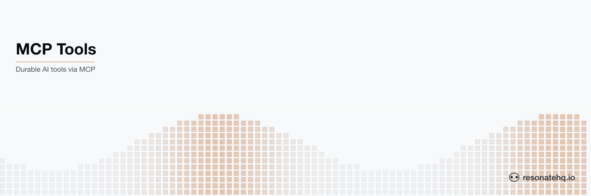

<picture>
  <source media="(prefers-color-scheme: dark)" srcset="./assets/banner-dark.png">
  <source media="(prefers-color-scheme: light)" srcset="./assets/banner-light.png">
  
</picture>

# MCP Tools

**Resonate Rust SDK**

This example showcases how to expose a durable Resonate workflow as a [Model Context Protocol](https://modelcontextprotocol.io) tool, so an LLM client like Claude Desktop can invoke it directly.

Instructions on [How to run this example](#how-to-run-the-example) are below. The full pattern is documented at [docs.resonatehq.io/get-started/examples/mcp-tools](https://docs.resonatehq.io/get-started/examples/mcp-tools).

## What it does

The MCP server exposes a single tool — `get_forecast` — that takes a latitude and longitude and returns a five-period weather forecast from the National Weather Service. Behind the tool sits a durable Resonate workflow running on a separate worker process. The MCP server itself is stateless; durability lives in the Resonate server.

```
Claude Desktop ── stdio ──▶ MCP server ── Resonate RPC ──▶ Worker
                                                              │
                                                              ▼
                                                        api.weather.gov
```

## Durable tool handlers

The tool body is a regular async Rust function annotated with `#[resonate::function]`. There are no decorators, no task queues, and no special return types — the function looks like ordinary code, and Resonate gives it crash-resilient retries and automatic checkpointing of intermediate steps.

```rust
#[resonate::function]
async fn get_forecast(ctx: &Context, latitude: f64, longitude: f64) -> Result<String> {
    // Each ctx.run is a durable step — checkpointed on success, retried on failure.
    let points: serde_json::Value = ctx.run(fetch_nws, points_url).await?;

    // Durable sleep — survives crashes and resumes on the same wall clock.
    ctx.sleep(std::time::Duration::from_millis(500)).await?;

    let forecast: serde_json::Value = ctx.run(fetch_nws, forecast_url).await?;

    Ok(format_forecast(forecast))
}
```

The MCP server registers a tool whose handler dispatches into the workflow via `resonate.rpc(...)`:

```rust
#[tool(description = "Get the National Weather Service forecast for a US location.")]
async fn get_forecast(
    &self,
    Parameters(ForecastRequest { latitude, longitude }): Parameters<ForecastRequest>,
) -> Result<CallToolResult, McpError> {
    let promise_id = format!("forecast-{latitude}-{longitude}");

    let result: String = self
        .resonate
        .rpc(&promise_id, "get_forecast", (latitude, longitude))
        .target("poll://any@workers")
        .await
        .map_err(|e| McpError::internal_error(format!("resonate rpc failed: {e}"), None))?;

    Ok(CallToolResult::success(vec![Content::text(result)]))
}
```

## Deduplication

Each Resonate function invocation pairs with a promise. Each promise has a unique ID.

In this example the promise ID is derived from the tool input (`forecast-{lat}-{lon}`), so concurrent calls for the same location reconnect to the in-flight execution rather than firing a second request to NWS. When the workflow resolves, subsequent calls for the same location return the cached result.

This is the same pattern used to deduplicate webhook deliveries — applied here to AI tool calls.

## Recovery

This example is also capable of showcasing Resonate's automatic load balancing and recovery.

Run multiple workers and trigger multiple tool calls. Each worker will pick up a workflow.

Try killing one of the workers while a forecast is in flight and watch the workflow recover on another worker. The latent state lives on the Resonate server; the resumed workflow continues from the last checkpoint rather than re-running the side effects already completed.

## How to run the example

This example uses [Cargo](https://www.rust-lang.org/tools/install) as the build tool and [`curl`](https://curl.se) as the HTTP client. After cloning, change directory into the project root.

This example application requires that a Resonate Server is running locally.

```shell
brew install resonatehq/tap/resonate
resonate dev
```

You will need 2 terminals to run this example, one for the Worker and one for the MCP Server. The MCP Server speaks the Model Context Protocol over stdio, so an MCP client (like Claude Desktop or `mcp-inspector`) drives it rather than a curl request.

In _Terminal 1_, start the Worker:

```shell
cargo run --bin worker
```

In _Terminal 2_, run the MCP Server in inspector mode to verify it works:

```shell
npx @modelcontextprotocol/inspector cargo run --bin weather-server
```

The inspector prints a URL — open it in your browser and call `get_forecast` with a US lat/lon (e.g. `latitude: 47.6062, longitude: -122.3321` for Seattle).

## Connect to Claude Desktop

Build a release binary first so Claude Desktop launches quickly:

```shell
cargo build --release --bin weather-server
```

Then add this to `~/Library/Application Support/Claude/claude_desktop_config.json`:

```json
{
  "mcpServers": {
    "resonate-weather": {
      "command": "/absolute/path/to/example-mcp-tools-rs/target/release/weather-server"
    }
  }
}
```

Restart Claude Desktop. The Resonate server (`resonate dev`) and the worker (`cargo run --bin worker`) both need to be running for the tool to resolve. Then ask Claude:

> What's the weather forecast for Seattle?

Claude will call `get_forecast`, the MCP server will RPC into the worker, and the worker will run the durable workflow against the National Weather Service.

## Learn more

- [Resonate Documentation](https://docs.resonatehq.io)
- [MCP Tools Pattern](https://docs.resonatehq.io/get-started/examples/mcp-tools)
- [Rust SDK Guide](https://docs.resonatehq.io/develop/rust)
- [Model Context Protocol](https://modelcontextprotocol.io)
